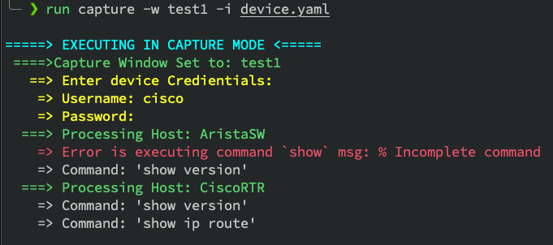
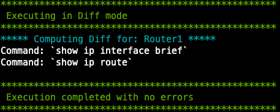
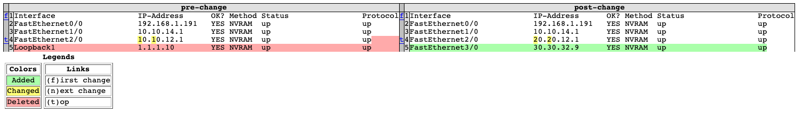

[](https://www.python.org/downloads/)

# Configuration Diff
This tool helps to collect output of specified commands during defined capture windows and produces HTML diff files highlighting the differences in command output.

# Installation
Execute the following command to install the tool. It is highly recommended that these be performed in a dedicated virtual environment.
```
sudo pip install -e .
```

# Usage
The applicaiton has two execution modes:
* capture: Used to capture command output and save files.
* diff: Used to compute diff between command output that was captured earlier.
Example:
```
run --help
Usage: run [OPTIONS] COMMAND [ARGS]...

Options:
  --help  Show this message and exit.

Commands:
  capture  Use this mode to capture command output and save to files.
  diff     Use this mode to compute diff in command output between two...
```

## Capture Mode
The capture mode accepts two arguments
* -w: A string value that defines the capture window (eg: Pre-cahneg)
* -i: Inventory file that contains the list of devices and commands to execute. rever to [device.yaml](device.yaml) for example.
Example
```
run capture [OPTIONS]

  Use this mode to capture command output and save to files.

Options:
  -w TEXT  Enter Capture Window.  [required]
  -i TEXT  Enter inventory file.  [required]
  --help   Show this message and exit.
```

## Diff mode
The diff mode accepts two arguments
* -w1: The first capture window against which the diff is to be generated.
* -w2: The second capture window against which the diff is to be generated.
Example
```
run diff --help
Usage: run diff [OPTIONS]

  Use this mode to compute diff in command output between two captures.

Options:
  -w1 TEXT  Enter Capture Window(pre-change)  [required]
  -w2 TEXT  Enter Capture Window to diff against(post-change)  [required]
  --help    Show this message and exit.
```

# Supported Vendors
The script uses netmiko to connect to devices and execute commands.
Supported `device_types` can be found in [ssh_dispatcher.py](https://github.com/ktbyers/netmiko/blob/master/netmiko/ssh_dispatcher.py), see CLASS_MAPPER keys.

# How it works

In **Capture mode**, the application will prompt for the `username` and `passowrd` used to login to the deivces. The command output is stored in a dedicated folder that is created with the capture window parameter that was passed. If a capture already exists for the window, the application is warn and terminate. In the event that the application was not able to execute a particular command on a device, a warn is displayed on screen but the application does not terminate. The applicaiton also tries to parse the output using [genie](https://developer.cisco.com/docs/genie-docs/) and if successsful a json output of the file is stored, if unsuccessful, the output is stores as a text file.

In **Diff mode**, the application generates HTML diff for command output in the provided capture window.It looks for any captures that are is present in one window and not the other and a warning is displayed on screen and continue. The results are saved in a dedicated folder that is created.

# Sample Output
### Capture mode


### Diff mode


### Sample diff output


## Author
Sudarshan Vijaya Kumar