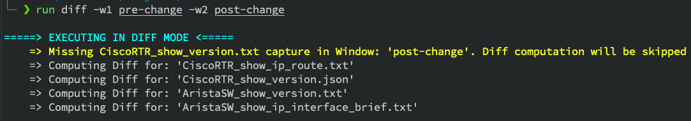

# Config Diff
This tool helps to collect output of specified commands during two stages `pre-change`,`post-change` and produces HTML diff files highlighting the differences in command output.

Example:
```
python config_diff.py -h
python config_diff.py --change post-change -device-list device.yaml
python config_diff.py -c pre-change -dl device.yaml
python config-diff.py -dl device.yaml -d
```

This tool has two execution modes:

* `-c` or `--change`: collection of data where it executes specified commands against network devices and stores the command output in files.
* `-d` or `--diff`: computational of difference between command output captured during pre-change and post-change stages.

The details of network node and commands are provided in a `yaml` file as illustrated below.
```
- hostname: Router1
  ip: 192.168.1.191
  os: cisco_ios
  command_list:
    - show ip interface brief
    - sh ip bgp summary

- hostname: Router2
  ip: 192.168.1.192
  os: juniper_junos
  command_list:
    - sh ip route
    - sh ip ospf neighbors
```

The `os` field refers to the Netmiko supported device types.
Supported device_types can be found in [ssh_dispatcher.py](https://github.com/ktbyers/netmiko/blob/master/netmiko/ssh_dispatcher.py), see CLASS_MAPPER keys.

## How it works

The script uses netmiko to connect to devices and execute commands. It will prompt the user to enter the `Username` and `Password` used to authenticate to the network deivice during execution.

The `-c` collection execution mode has two options `pre-change` and `post-change`. For each of these options a dedicated folder is created to store the results. If either of the captures already exist, the program warns the user and exits.
Specified commands are executed against network nodes and the output is saved in files.

The `-d` diff mode execution compares the difference in command output between `post-change` and `pre-change` and produces HTML diff files and stores it in a dedicated diff folder. If either a `post-change` or 'pre-change` capture is missing, the program warns the user. Similarly if a diff already exists, a warning is displayed and the program exits.

## Sample Output
### -c or --change execution mode


### -d or --diff execution mode


### Sample dif output


## Author
Sudarshan Vijaya Kumar